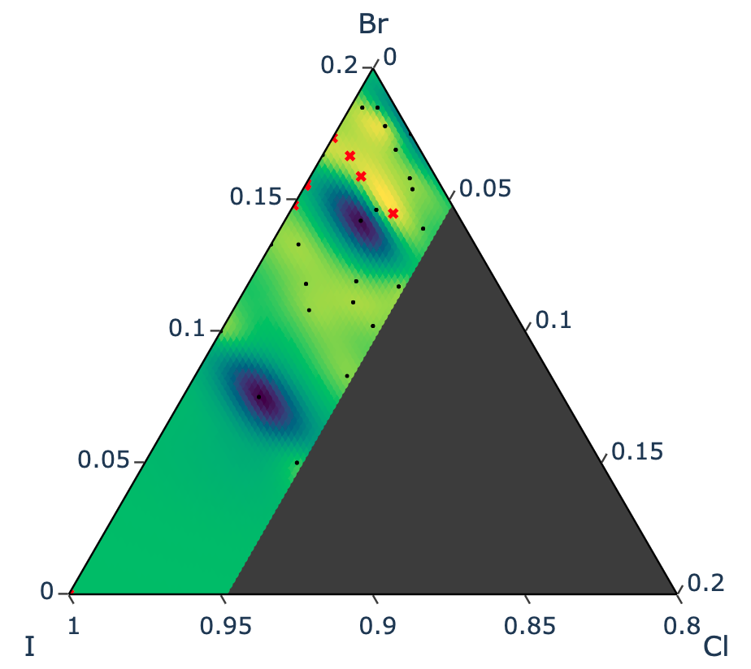

# BO-PV
Bayesian Optimization for Metal Halide Perovskites

## Motivation

This repo is dedicated to the pipeline design and operation of ax.dev for multiobjective (or single) BO with materials discovery in mind.
### Demo of BO Results

Fitted response surface in background. Priors are black circles, with the suggested next batch of n samples in red X symbol. 

